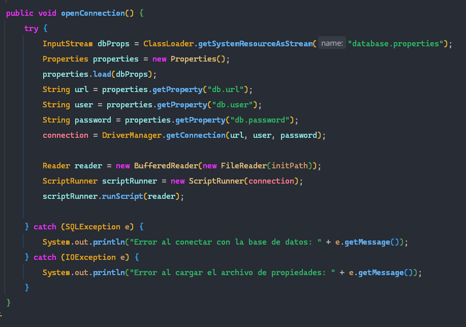
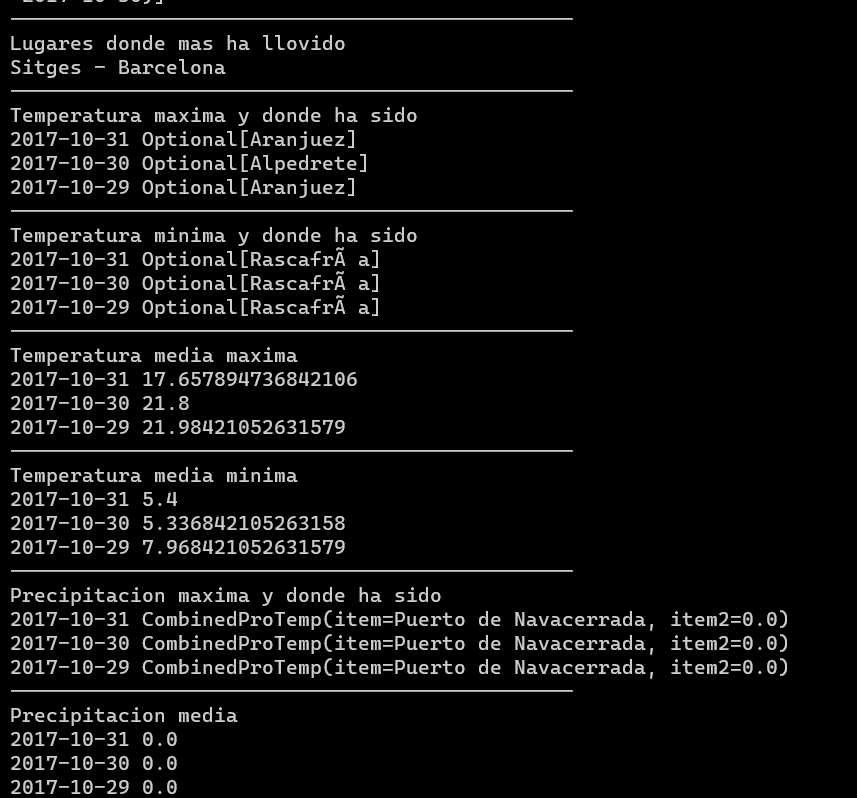

# Proyecto Amet de Jaime Medina y Eva Gómez

## Funcionamiento principal

**¿DE QUE TRATA?**
> El proyecto comienza leyendo 3 ficheros con extensión .csv en los cuales se encuentran los datos del tiempo que
> queremos añadir a nuestra aplicación, tales como:

1. Provincia
2. Localidad
3. Temperatura máxima
4. Hora de temperatura máxima
5. Temperatura mínima
6. Hora de temperatura mínima
7. Precipitación

> Para procesar estos datos hemos creado un objeto llamado **Weather**, en el que tenemos como atributos todos estos
> campos y también añadimos el campo "dia", un campo del tipo LocalDate que obtendremos gracias al nombre del fichero.
> Para no tener problemas leyendo el fichero tenemos el metodo **changeEncoding** el cual nos permite cambiar la
> codificación del archivo a UTF-8.
 

## Base de datos

**SGBD**
> En la carpeta **services** nos encontramos con la clase DB, esta clase se encarga de lo relacionado con la base de
> datos. En esta clase el método a destacar es **openConnection**, en él cargamos las propiedades del archivo
*database.properties* con la clase **Properties**, establecemos la conexión con **DriverManager** y ejecutamos el
> archivo *init.sql* en el que tenemos la sentencia para crear la tabla Weather.

**WeatherManager y CRUD**
> La interfaz **CRUD** contiene los siguientes métodos a implementar:

1. Save
2. Update
3. FindByLocalidadAndProvincia
4. FindAll
5. Delete
6. DeleteAll

> La clase WeatherManager implementa dicha interfaz y tiene estos métodos codificados. Para ejecutar una query en la
> base de datos desde uno de estos métodos tenemos que hacer uso de la clase **PreparedStatement** o **ResultSet**. Este
> es la query que se usa para insertar un nuevo objeto en la base de datos:

    INSERT INTO WEATHER (localidad, provincia, tempMax, horaTempMax, tempMin, horaTempMin, precipitacion, dia) VALUES (?, ?, ?, ?, ?, ?, ?, ?)

> Esto debemos de introducirlo en una variable tipo String como *sqlQuery* en nuestro caso y lo usaremos con
> PreparedStatement de la siguiente forma:

    PreparedStatement statement = connection.prepareStatement(sqlQuery);

> Para establecer los valores a cada campo lo haremos con el método de la clase *PreparedStatement* que corresponda, por
> ejemplo, si el campo es de timpo varchar lo haremos con .setString y le pasaremos por parámetro el número de campo que
> es y el metodo get del campo que queramos introducir, por ejemplo:

    statement.setString(1, weather.getLocalidad());
    statement.setString(2, weather.getProvincia());
    statement.setDouble(3, weather.getTempMax()); 

**Métodos en WeatherManager**

> Una vez codificados los métodos de la clase CRUD nos encontramos con los métodos solicitados en el ejercicio, estos
> los haremos con la API Stream de java.
> Para realizar estos ejercicios hemos realizado un método por cada uno de ellos, en los que devolvemos un Map con clave
> y valor. Dependiendo del ejercicio se devuelve un objeto distinto, pero la forma de operar en cada uno de ellos es
> similar. Cojamos de ejemplo el primer método, *maxTemp*

    public Map<LocalDate, Optional<String>> maxTemp() {
	    List<Weather> weathers = findAll();  
	    return weathers.stream().collect(groupingBy(Weather::getDay, collectingAndThen(maxBy(comparingDouble(Weather::getTempMax)), w -> w.map(Weather::getProvincia)))); }

> En este método devolvemos un mapa en el que la clave es el día y el valor es un String con el nombre de la provincia.
> Expliquemos el método, para empezar obtenemos una lista con todos los objetos en la base de datos usando el método
> findAll. Después usamos .stream().collect() y dentro hacemos uso de groupingBy, esto nos permite agrupar por días.
> *CollectingAndThen* nos permite ejecutar una acción en el resultado que nos queda después del primer parámetro, que en
> nuestro caso es *maxBy*, que utiliza *comparingDouble* para obtener la mayor temperatura.
 
> Ya que la mayoría de métodos se realizan de la misma forma explicaremos solo algunos de ellos. Por ejemplo, en el caso
> del método que devuelve la temperatura agrupada por provincias y días, *getAverageTempByGroup* hemos tenido que crear un
> Objeto llamado **CombinedProTemp**, en este tenemos dos campos genéricos para poder usarlo en otros ejercicios. En este
> caso guardamos la provincia y el día, para así poder devolver un Map con CombinedProTemp y con un Double, que en este
> caso es la media de la temperatura.
> public Map<CombinedProTemp, Double> getAverageTempByGroup() {

    List<Weather> weathers = findAll();  
        return weathers.stream().collect(groupingBy(combined -> new CombinedProTemp(combined.getProvincia(), combined.getDay()), averagingDouble(Weather::getTempMax)));  
    }

**Exportar a Json**
> Para exportar a Json tenemos un método llamado **exportToJson** en la clase WeatherController, en esta hacemos uso de
> GsonBuilder y para ello tenemos que agregar la dependencia de Gson en el archivo build.gradle.kts.
> En este método le pasamos por parámetro el nombre de la provincia que queremos guardar y se nos guardarán todas las
> localidades que tengan como nombre esa provincia. Dado que al pasar un LocalDate a Json genera problemas hemos tenido
> que crear una clase llamada **LocalDateAdapter**, y esta implementa la interfaz JsonSerializer. Esta clase solo tiene un
> método llamado serialize y devuelve JsonObject. A este objeto se le añaden las propiedades del objeto weather de la
> siguiente forma:

    JsonObject jsonObject = new JsonObject();  
    jsonObject.addProperty("localidad", weatherType.getLocalidad());  
    jsonObject.addProperty("provincia", weatherType.getProvincia());  
    jsonObject.addProperty("tempMax", weatherType.getTempMax());

> Para poder usar esta clase tenemos que escribir la anotación @JsonAdapter(LocalDateAdapter.class) en la clase Weather.
> De esta forma ya podremos escribir en el Json sin problemas de fecha. Ahora en el método tendremos que escribir lo
> siguiente:

    GsonBuilder gsonBuilder = new GsonBuilder();  
    gsonBuilder.registerTypeAdapter(Weather.class, new LocalDateAdapter());  
    Gson gson = new GsonBuilder().setPrettyPrinting().create();
    gson.toJson(findByNombre(provincia), writer);

**Ejecución**
> Para ejecutar el programa se utiliza la clase main, en esta nos encontramos con la instancia de weatherManager,
> weatherController y la clase db. Tenemos un bucle para guardar en la tabla WEATHER todos los objetos Weather que están
> en la lista weatherList.
> Después llamamos al método exportToJson que exporta a un fichero Json los datos de las localidades que sean de la
> provincia indicada, en este caso Madrid.
> Posteriormente, llamamos a todos los métodos de la clase weatherManager y creamos tablas en función de los tipos que nos
> devuelvan los métodos, de este modo podremos mostrar los resultados obtenidos. Si todo es correcto nos debería aparecer
> esto al ejecutar:

